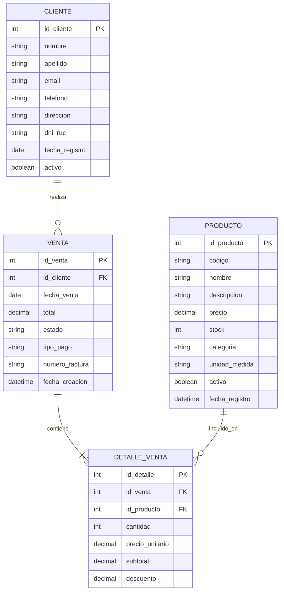

# 🏪 Modelo Conceptual de Base de Datos - Sistema de Tienda

> **Fecha de creación:** 22 de noviembre de 2025  
> **Descripción:** Modelo relacional para gestión de ventas en una tienda

---

## 📊 Diagrama Entidad-Relación



---

## 📝 Descripción de Tablas

### 👤 **CLIENTE**
Almacena la información de los clientes de la tienda.

| Campo            | Tipo         | Descripción                           |
|------------------|--------------|---------------------------------------|
| id_cliente       | INT          | Identificador único (PK)              |
| nombre           | VARCHAR(100) | Nombre del cliente                    |
| apellido         | VARCHAR(100) | Apellido del cliente                  |
| email            | VARCHAR(150) | Correo electrónico                    |
| telefono         | VARCHAR(20)  | Número de teléfono                    |
| direccion        | VARCHAR(255) | Dirección física                      |
| dni_ruc          | VARCHAR(20)  | DNI o RUC del cliente                 |
| fecha_registro   | DATE         | Fecha de registro en el sistema       |
| activo           | BOOLEAN      | Estado del cliente (activo/inactivo)  |

---

### 🛒 **VENTA**
Registra las ventas realizadas a los clientes.

| Campo            | Tipo          | Descripción                          |
|------------------|---------------|--------------------------------------|
| id_venta         | INT           | Identificador único (PK)             |
| id_cliente       | INT           | Referencia al cliente (FK)           |
| fecha_venta      | DATE          | Fecha de la venta                    |
| total            | DECIMAL(10,2) | Monto total de la venta              |
| estado           | VARCHAR(20)   | Estado: pendiente, completada, anulada |
| tipo_pago        | VARCHAR(50)   | Efectivo, tarjeta, transferencia     |
| numero_factura   | VARCHAR(50)   | Número de factura generada           |
| fecha_creacion   | DATETIME      | Fecha y hora de creación del registro|

---

### 📋 **DETALLE_VENTA**
Detalla los productos incluidos en cada venta.

| Campo            | Tipo          | Descripción                          |
|------------------|---------------|--------------------------------------|
| id_detalle       | INT           | Identificador único (PK)             |
| id_venta         | INT           | Referencia a la venta (FK)           |
| id_producto      | INT           | Referencia al producto (FK)          |
| cantidad         | INT           | Cantidad de productos vendidos       |
| precio_unitario  | DECIMAL(10,2) | Precio unitario al momento de venta  |
| subtotal         | DECIMAL(10,2) | Cantidad × Precio unitario           |
| descuento        | DECIMAL(10,2) | Descuento aplicado (si existe)       |

---

### 📦 **PRODUCTO**
Catálogo de productos disponibles en la tienda.

| Campo            | Tipo          | Descripción                          |
|------------------|---------------|--------------------------------------|
| id_producto      | INT           | Identificador único (PK)             |
| codigo           | VARCHAR(50)   | Código del producto (SKU)            |
| nombre           | VARCHAR(200)  | Nombre del producto                  |
| descripcion      | TEXT          | Descripción detallada                |
| precio           | DECIMAL(10,2) | Precio de venta                      |
| stock            | INT           | Cantidad disponible en inventario    |
| categoria        | VARCHAR(100)  | Categoría del producto               |
| unidad_medida    | VARCHAR(20)   | Unidad (pieza, kg, litro, etc.)      |
| activo           | BOOLEAN       | Estado del producto                  |
| fecha_registro   | DATETIME      | Fecha de registro del producto       |

---

## 🔗 Relaciones

1. **CLIENTE → VENTA** (1:N)
   - Un cliente puede realizar muchas ventas
   - Una venta pertenece a un solo cliente

2. **VENTA → DETALLE_VENTA** (1:N)
   - Una venta puede tener múltiples detalles (productos)
   - Cada detalle pertenece a una sola venta

3. **PRODUCTO → DETALLE_VENTA** (1:N)
   - Un producto puede estar en múltiples detalles de venta
   - Cada detalle referencia a un solo producto

---

## 🎯 Reglas de Negocio

1. **Integridad Referencial:**
   - No se puede eliminar un cliente con ventas asociadas
   - No se puede eliminar un producto que esté en detalles de venta

2. **Cálculos Automáticos:**
   - `subtotal = cantidad × precio_unitario - descuento`
   - `total_venta = SUM(subtotal de todos los detalles)`

3. **Validaciones:**
   - El stock debe ser mayor o igual a 0
   - La cantidad en detalle_venta no puede exceder el stock disponible
   - Los precios deben ser mayores a 0

4. **Estados de Venta:**
   - `pendiente`: Venta registrada pero no completada
   - `completada`: Venta finalizada y pagada
   - `anulada`: Venta cancelada (devuelve stock)

---

## 💡 Consultas SQL Útiles

### Consultar ventas de un cliente
```sql
SELECT v.*, c.nombre, c.apellido
FROM VENTA v
INNER JOIN CLIENTE c ON v.id_cliente = c.id_cliente
WHERE c.id_cliente = 1;
```

### Detalle completo de una venta
```sql
SELECT 
    v.numero_factura,
    v.fecha_venta,
    c.nombre AS cliente,
    p.nombre AS producto,
    dv.cantidad,
    dv.precio_unitario,
    dv.subtotal
FROM VENTA v
INNER JOIN CLIENTE c ON v.id_cliente = c.id_cliente
INNER JOIN DETALLE_VENTA dv ON v.id_venta = dv.id_venta
INNER JOIN PRODUCTO p ON dv.id_producto = p.id_producto
WHERE v.id_venta = 1;
```

### Productos más vendidos
```sql
SELECT 
    p.nombre,
    SUM(dv.cantidad) AS total_vendido,
    SUM(dv.subtotal) AS ingresos_generados
FROM PRODUCTO p
INNER JOIN DETALLE_VENTA dv ON p.id_producto = dv.id_producto
GROUP BY p.id_producto, p.nombre
ORDER BY total_vendido DESC
LIMIT 10;
```

### Ventas por cliente
```sql
SELECT 
    c.nombre,
    c.apellido,
    COUNT(v.id_venta) AS total_compras,
    SUM(v.total) AS monto_total
FROM CLIENTE c
LEFT JOIN VENTA v ON c.id_cliente = v.id_cliente
GROUP BY c.id_cliente, c.nombre, c.apellido
ORDER BY monto_total DESC;
```

---

## 🗄️ Script de Creación (SQL)

```sql
-- Crear tabla CLIENTE
CREATE TABLE CLIENTE (
    id_cliente INT PRIMARY KEY AUTO_INCREMENT,
    nombre VARCHAR(100) NOT NULL,
    apellido VARCHAR(100) NOT NULL,
    email VARCHAR(150) UNIQUE,
    telefono VARCHAR(20),
    direccion VARCHAR(255),
    dni_ruc VARCHAR(20) UNIQUE,
    fecha_registro DATE DEFAULT CURRENT_DATE,
    activo BOOLEAN DEFAULT TRUE
);

-- Crear tabla PRODUCTO
CREATE TABLE PRODUCTO (
    id_producto INT PRIMARY KEY AUTO_INCREMENT,
    codigo VARCHAR(50) UNIQUE NOT NULL,
    nombre VARCHAR(200) NOT NULL,
    descripcion TEXT,
    precio DECIMAL(10,2) NOT NULL CHECK (precio > 0),
    stock INT NOT NULL DEFAULT 0 CHECK (stock >= 0),
    categoria VARCHAR(100),
    unidad_medida VARCHAR(20),
    activo BOOLEAN DEFAULT TRUE,
    fecha_registro DATETIME DEFAULT CURRENT_TIMESTAMP
);

-- Crear tabla VENTA
CREATE TABLE VENTA (
    id_venta INT PRIMARY KEY AUTO_INCREMENT,
    id_cliente INT NOT NULL,
    fecha_venta DATE DEFAULT CURRENT_DATE,
    total DECIMAL(10,2) NOT NULL DEFAULT 0,
    estado VARCHAR(20) DEFAULT 'pendiente',
    tipo_pago VARCHAR(50),
    numero_factura VARCHAR(50) UNIQUE,
    fecha_creacion DATETIME DEFAULT CURRENT_TIMESTAMP,
    FOREIGN KEY (id_cliente) REFERENCES CLIENTE(id_cliente)
);

-- Crear tabla DETALLE_VENTA
CREATE TABLE DETALLE_VENTA (
    id_detalle INT PRIMARY KEY AUTO_INCREMENT,
    id_venta INT NOT NULL,
    id_producto INT NOT NULL,
    cantidad INT NOT NULL CHECK (cantidad > 0),
    precio_unitario DECIMAL(10,2) NOT NULL,
    subtotal DECIMAL(10,2) NOT NULL,
    descuento DECIMAL(10,2) DEFAULT 0,
    FOREIGN KEY (id_venta) REFERENCES VENTA(id_venta),
    FOREIGN KEY (id_producto) REFERENCES PRODUCTO(id_producto)
);

-- Índices para mejorar rendimiento
CREATE INDEX idx_venta_cliente ON VENTA(id_cliente);
CREATE INDEX idx_venta_fecha ON VENTA(fecha_venta);
CREATE INDEX idx_detalle_venta ON DETALLE_VENTA(id_venta);
CREATE INDEX idx_detalle_producto ON DETALLE_VENTA(id_producto);
CREATE INDEX idx_producto_codigo ON PRODUCTO(codigo);
```

---

## 📊 Datos de Ejemplo

```sql
-- Insertar clientes
INSERT INTO CLIENTE (nombre, apellido, email, telefono, dni_ruc) VALUES
('Juan', 'Pérez', 'juan.perez@email.com', '0999123456', '1234567890'),
('María', 'García', 'maria.garcia@email.com', '0998765432', '0987654321');

-- Insertar productos
INSERT INTO PRODUCTO (codigo, nombre, precio, stock, categoria, unidad_medida) VALUES
('PROD001', 'Laptop HP', 850.00, 10, 'Electrónica', 'unidad'),
('PROD002', 'Mouse Inalámbrico', 15.50, 50, 'Accesorios', 'unidad'),
('PROD003', 'Teclado Mecánico', 75.00, 25, 'Accesorios', 'unidad');

-- Insertar venta
INSERT INTO VENTA (id_cliente, total, estado, tipo_pago, numero_factura) VALUES
(1, 940.50, 'completada', 'tarjeta', 'FACT-001');

-- Insertar detalles de venta
INSERT INTO DETALLE_VENTA (id_venta, id_producto, cantidad, precio_unitario, subtotal) VALUES
(1, 1, 1, 850.00, 850.00),
(1, 2, 2, 15.50, 31.00),
(1, 3, 1, 75.00, 75.00);
```

---

¡Modelo conceptual completado! 🎉
