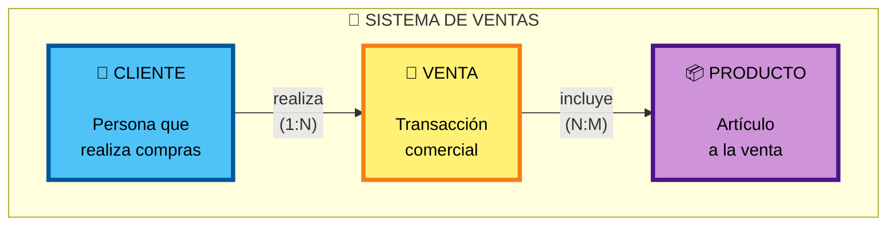
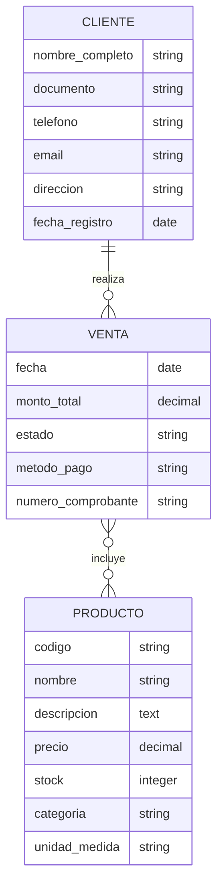
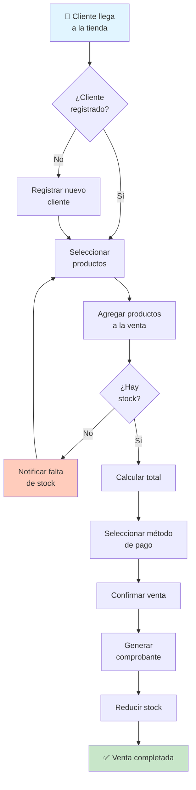

# 🎯 Modelo Conceptual - Sistema de Tienda

> **Nivel:** Conceptual (Alto nivel)  
> **Fecha:** 22 de noviembre de 2025  
> **Propósito:** Representación abstracta del dominio del negocio

---

## 📊 Diagrama Entidad-Relación Conceptual



---

## 🏗️ Entidades Principales

### 👤 **CLIENTE**
**Definición:** Persona natural o jurídica que realiza compras en la tienda.

**Atributos:**
- Nombre completo
- Documento de identificación (DNI/RUC)
- Teléfono de contacto
- Correo electrónico
- Dirección física
- Fecha de registro en el sistema

---

### 🛒 **VENTA**
**Definición:** Operación comercial mediante la cual un cliente adquiere productos.

**Atributos:**
- Fecha de la transacción
- Monto total de la compra
- Estado (pendiente, completada, anulada)
- Método de pago (efectivo, tarjeta, transferencia)
- Número de comprobante/factura

---

### 📦 **PRODUCTO**
**Definición:** Artículo o mercancía disponible para ser vendida.

**Atributos:**
- Código único del producto
- Nombre descriptivo
- Descripción detallada
- Precio de venta
- Cantidad disponible en stock
- Categoría
- Unidad de medida (pieza, kg, litro, etc.)

---

## 🔗 Relaciones

### 1️⃣ **CLIENTE realiza VENTA**
- **Tipo:** Uno a Muchos (1:N)
- **Lectura:** Un cliente puede realizar muchas ventas
- **Lectura inversa:** Cada venta es realizada por un único cliente
- **Obligatoriedad:** Toda venta debe tener un cliente asociado

**Ejemplo:**
- El cliente "Juan Pérez" ha realizado 5 ventas en el mes
- La venta #001 pertenece al cliente "Juan Pérez"

---

### 2️⃣ **VENTA incluye PRODUCTO**
- **Tipo:** Muchos a Muchos (N:M)
- **Lectura:** Una venta puede incluir múltiples productos
- **Lectura inversa:** Un producto puede estar en múltiples ventas
- **Obligatoriedad:** Una venta debe incluir al menos un producto

**Atributos de la relación:**
- Cantidad vendida
- Precio unitario (al momento de la venta)
- Descuento aplicado
- Subtotal de la línea

**Ejemplo:**
- La venta #001 incluye: 2 laptops, 1 mouse, 1 teclado
- El producto "Laptop HP" ha sido vendido en 15 ventas diferentes

---

## 📐 Diagrama ER Detallado



> **Nota:** La relación N:M entre VENTA y PRODUCTO se implementará mediante una tabla intermedia llamada "DETALLE_VENTA" en el modelo lógico.

---

## 🎯 Reglas de Negocio

### Restricciones:
1. ✅ Toda venta debe estar asociada a un cliente registrado
2. ✅ Una venta debe incluir al menos un producto
3. ✅ No se puede vender más cantidad de la disponible en stock
4. ✅ Las cantidades vendidas deben ser mayores a cero
5. ✅ Los precios deben ser valores positivos

### Políticas de Negocio:
1. 📌 El precio del producto se captura al momento de la venta (puede diferir del precio actual)
2. 📌 El monto total es la suma de todos los subtotales de productos
3. 📌 Un cliente puede realizar múltiples compras a lo largo del tiempo
4. 📌 El stock se reduce automáticamente al confirmar una venta
5. 📌 Una venta anulada debe restaurar el stock de los productos

---

## 💼 Proceso de Negocio



---

## 📊 Cardinalidades Explicadas

| Relación | Cardinalidad | Significado |
|----------|--------------|-------------|
| CLIENTE → VENTA | 1:N | Un cliente puede hacer 0, 1 o muchas ventas |
| VENTA → CLIENTE | N:1 | Cada venta pertenece exactamente a 1 cliente |
| VENTA → PRODUCTO | N:M | Una venta incluye 1 o muchos productos |
| PRODUCTO → VENTA | N:M | Un producto puede estar en 0, 1 o muchas ventas |

---

## 🎨 Diagrama Conceptual Simplificado

```
    ┌─────────────┐
    │   CLIENTE   │
    │             │
    │ • Nombre    │
    │ • Documento │
    │ • Contacto  │
    └──────┬──────┘
           │ realiza
           │ (1:N)
           ▼
    ┌─────────────┐
    │    VENTA    │
    │             │
    │ • Fecha     │
    │ • Total     │
    │ • Estado    │
    └──────┬──────┘
           │ incluye
           │ (N:M)
           ▼
    ┌─────────────┐
    │  PRODUCTO   │
    │             │
    │ • Código    │
    │ • Nombre    │
    │ • Precio    │
    │ • Stock     │
    └─────────────┘
```

---

## 📖 Glosario

| Término | Definición |
|---------|-----------|
| **Entidad** | Objeto del mundo real con existencia independiente |
| **Atributo** | Característica que describe una entidad |
| **Relación** | Asociación significativa entre entidades |
| **Cardinalidad** | Número de instancias que pueden asociarse |
| **1:N** | Uno a muchos |
| **N:M** | Muchos a muchos |
| **Dominio** | Conjunto de valores válidos para un atributo |

---

## ✅ Validación del Modelo

### Preguntas de verificación:
- ✓ ¿Se capturan todos los datos necesarios del negocio?
- ✓ ¿Las relaciones reflejan la realidad del negocio?
- ✓ ¿Las cardinalidades son correctas?
- ✓ ¿Se pueden responder las consultas del negocio?
- ✓ ¿El modelo es comprensible para los usuarios?

---

## 🚀 Siguiente Paso

Este modelo conceptual servirá como base para crear:
1. **Modelo Lógico:** Definición de claves, tipos de datos, normalización
2. **Modelo Físico:** Implementación específica en el SGBD elegido

---

**📌 Características del Modelo Conceptual:**
- ✨ Independiente de tecnología
- 🎯 Enfocado en el negocio
- 💬 Lenguaje natural
- 👥 Entendible por todos los stakeholders
- 📋 Base para modelos técnicos posteriores
