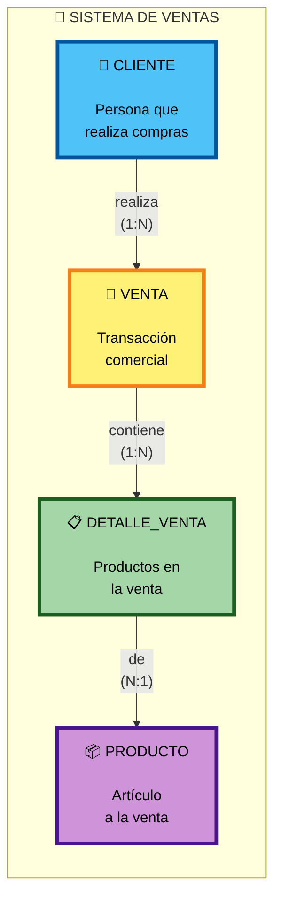
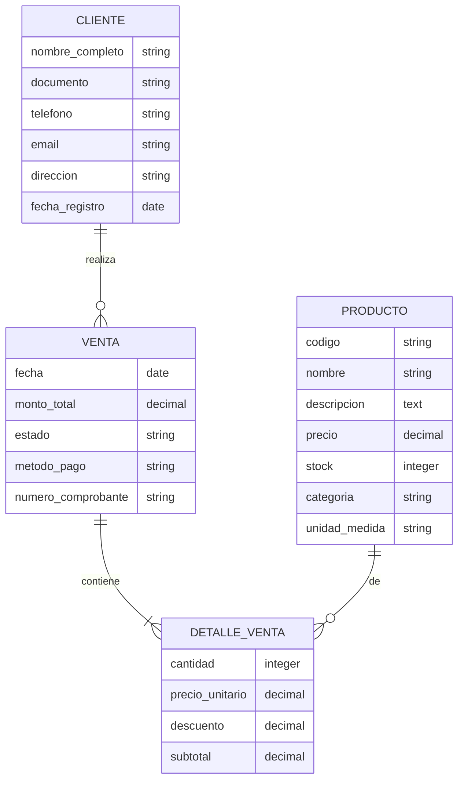
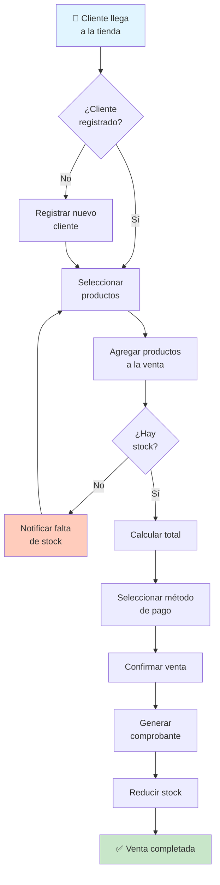

# 🎯 Modelo Conceptual - Sistema de Tienda

> **Nivel:** Conceptual (Alto nivel)  
> **Fecha:** 22 de noviembre de 2025  
> **Propósito:** Representación abstracta del dominio del negocio

---

## 📊 Diagrama Entidad-Relación Conceptual



---

## 🏗️ Entidades Principales

### 👤 **CLIENTE**
**Definición:** Persona natural o jurídica que realiza compras en la tienda.

**Atributos:**
- Nombre completo
- Documento de identificación (DNI/RUC)
- Teléfono de contacto
- Correo electrónico
- Dirección física
- Fecha de registro en el sistema

---

### 🛒 **VENTA**
**Definición:** Operación comercial mediante la cual un cliente adquiere productos.

**Atributos:**
- Fecha de la transacción
- Monto total de la compra
- Estado (pendiente, completada, anulada)
- Método de pago (efectivo, tarjeta, transferencia)
- Número de comprobante/factura

---

### � **DETALLE_VENTA**
**Definición:** Entidad asociativa que representa cada producto incluido en una venta específica.

**Atributos:**
- Cantidad vendida del producto
- Precio unitario al momento de la venta
- Descuento aplicado a esta línea
- Subtotal de la línea (cantidad × precio - descuento)

> **Nota:** Esta entidad resuelve la relación muchos a muchos (N:M) entre VENTA y PRODUCTO.

---

### �📦 **PRODUCTO**
**Definición:** Artículo o mercancía disponible para ser vendida.

**Atributos:**
- Código único del producto
- Nombre descriptivo
- Descripción detallada
- Precio de venta
- Cantidad disponible en stock
- Categoría
- Unidad de medida (pieza, kg, litro, etc.)

---

## 🔗 Relaciones

### 1️⃣ **CLIENTE realiza VENTA**
- **Tipo:** Uno a Muchos (1:N)
- **Lectura:** Un cliente puede realizar muchas ventas
- **Lectura inversa:** Cada venta es realizada por un único cliente
- **Obligatoriedad:** Toda venta debe tener un cliente asociado

**Ejemplo:**
- El cliente "Juan Pérez" ha realizado 5 ventas en el mes
- La venta #001 pertenece al cliente "Juan Pérez"

---

### 2️⃣ **VENTA contiene DETALLE_VENTA**
- **Tipo:** Uno a Muchos (1:N)
- **Lectura:** Una venta puede contener múltiples detalles (líneas de productos)
- **Lectura inversa:** Cada detalle pertenece a una única venta
- **Obligatoriedad:** Una venta debe tener al menos un detalle

**Ejemplo:**
- La venta #001 contiene 3 detalles: detalle_1, detalle_2, detalle_3
- El detalle_1 pertenece a la venta #001

---

### 3️⃣ **DETALLE_VENTA de PRODUCTO**
- **Tipo:** Muchos a Uno (N:1)
- **Lectura:** Muchos detalles pueden referenciar al mismo producto
- **Lectura inversa:** Cada detalle corresponde a un único producto
- **Obligatoriedad:** Cada detalle debe tener un producto asociado

**Ejemplo:**
- 15 detalles diferentes referencian al producto "Laptop HP"
- El detalle_1 corresponde al producto "Laptop HP"

---

### 📊 **Resumen de la Relación N:M Resuelta**

La relación original **VENTA ↔ PRODUCTO** (N:M) se descompone en:
- **VENTA → DETALLE_VENTA** (1:N)
- **DETALLE_VENTA → PRODUCTO** (N:1)

**Resultado:**
- Una venta puede incluir múltiples productos (a través de DETALLE_VENTA)
- Un producto puede estar en múltiples ventas (a través de DETALLE_VENTA)
- Los atributos de la relación (cantidad, precio, descuento) se guardan en DETALLE_VENTA

---

## 📐 Diagrama ER Detallado



> **Nota:** DETALLE_VENTA es una **entidad asociativa** que transforma la relación N:M entre VENTA y PRODUCTO en dos relaciones 1:N, permitiendo almacenar los atributos propios de cada línea de venta.

---

## 🎯 Reglas de Negocio

### Restricciones:
1. ✅ Toda venta debe estar asociada a un cliente registrado
2. ✅ Una venta debe incluir al menos un producto
3. ✅ No se puede vender más cantidad de la disponible en stock
4. ✅ Las cantidades vendidas deben ser mayores a cero
5. ✅ Los precios deben ser valores positivos

### Políticas de Negocio:
1. 📌 El precio del producto se captura al momento de la venta (puede diferir del precio actual)
2. 📌 El monto total es la suma de todos los subtotales de productos
3. 📌 Un cliente puede realizar múltiples compras a lo largo del tiempo
4. 📌 El stock se reduce automáticamente al confirmar una venta
5. 📌 Una venta anulada debe restaurar el stock de los productos

---

## 💼 Proceso de Negocio



---

## 📊 Cardinalidades Explicadas

| Relación | Cardinalidad | Significado |
|----------|--------------|-------------|
| CLIENTE → VENTA | 1:N | Un cliente puede hacer 0, 1 o muchas ventas |
| VENTA → CLIENTE | N:1 | Cada venta pertenece exactamente a 1 cliente |
| VENTA → DETALLE_VENTA | 1:N | Una venta contiene 1 o muchos detalles |
| DETALLE_VENTA → VENTA | N:1 | Cada detalle pertenece a 1 venta |
| PRODUCTO → DETALLE_VENTA | 1:N | Un producto puede estar en 0, 1 o muchos detalles |
| DETALLE_VENTA → PRODUCTO | N:1 | Cada detalle corresponde a 1 producto |

**Relación N:M original (conceptual):**
- VENTA ↔ PRODUCTO: Una venta incluye muchos productos; un producto puede estar en muchas ventas
- Se resuelve mediante la entidad asociativa DETALLE_VENTA

---

## 🎨 Diagrama Conceptual Simplificado

```
    ┌──────────────┐
    │   CLIENTE    │
    │              │
    │ • Nombre     │
    │ • Documento  │
    │ • Contacto   │
    └──────┬───────┘
           │ realiza
           │ (1:N)
           ▼
    ┌──────────────┐
    │    VENTA     │
    │              │
    │ • Fecha      │
    │ • Total      │
    │ • Estado     │
    └──────┬───────┘
           │ contiene
           │ (1:N)
           ▼
    ┌──────────────┐
    │DETALLE_VENTA │ ◄───── entidad intermedia
    │              │        (resuelve N:M)
    │ • Cantidad   │
    │ • Precio     │
    │ • Subtotal   │
    │ • Descuento  │
    └──────┬───────┘
           │ de
           │ (N:1)
           ▼
    ┌──────────────┐
    │  PRODUCTO    │
    │              │
    │ • Código     │
    │ • Nombre     │
    │ • Precio     │
    │ • Stock      │
    └──────────────┘
```

**Explicación:**
- La relación N:M entre VENTA y PRODUCTO se descompone en dos relaciones 1:N
- DETALLE_VENTA actúa como **entidad asociativa** que conecta ambas entidades
- Los atributos de la relación (cantidad, precio, descuento) se almacenan en DETALLE_VENTA

---

## 📖 Glosario

| Término | Definición |
|---------|-----------|
| **Entidad** | Objeto del mundo real con existencia independiente |
| **Atributo** | Característica que describe una entidad |
| **Relación** | Asociación significativa entre entidades |
| **Cardinalidad** | Número de instancias que pueden asociarse |
| **1:N** | Uno a muchos |
| **N:M** | Muchos a muchos |
| **Dominio** | Conjunto de valores válidos para un atributo |

---

## ✅ Validación del Modelo

### Preguntas de verificación:
- ✓ ¿Se capturan todos los datos necesarios del negocio?
- ✓ ¿Las relaciones reflejan la realidad del negocio?
- ✓ ¿Las cardinalidades son correctas?
- ✓ ¿Se pueden responder las consultas del negocio?
- ✓ ¿El modelo es comprensible para los usuarios?

---

## 🚀 Siguiente Paso

Este modelo conceptual servirá como base para crear:
1. **Modelo Lógico:** Definición de claves, tipos de datos, normalización
2. **Modelo Físico:** Implementación específica en el SGBD elegido

---

**📌 Características del Modelo Conceptual:**
- ✨ Independiente de tecnología
- 🎯 Enfocado en el negocio
- 💬 Lenguaje natural
- 👥 Entendible por todos los stakeholders
- 📋 Base para modelos técnicos posteriores
