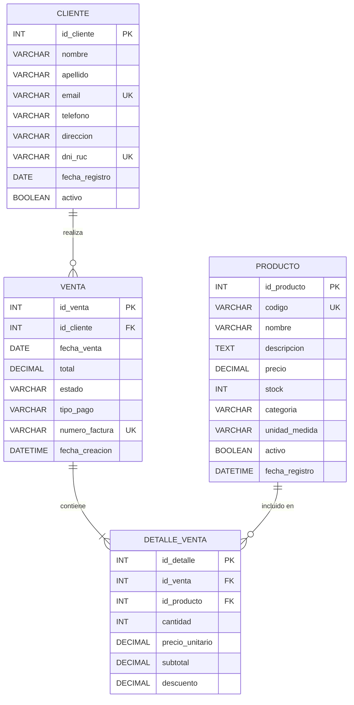

# 🔷 Modelo Lógico - Sistema de Tienda

> **Nivel:** Lógico (Diseño de datos)  
> **Fecha:** 22 de noviembre de 2025  
> **Propósito:** Estructura de datos independiente del SGBD específico

---

## 📊 Diagrama Entidad-Relación Lógico



---

## 📋 Definición de Tablas

### 🔹 CLIENTE

| Columna | Tipo de Dato | Restricciones | Descripción |
|---------|--------------|---------------|-------------|
| id_cliente | INT | PK, AUTO_INCREMENT | Identificador único |
| nombre | VARCHAR(100) | NOT NULL | Nombre del cliente |
| apellido | VARCHAR(100) | NOT NULL | Apellido del cliente |
| email | VARCHAR(150) | UNIQUE, NULL | Correo electrónico |
| telefono | VARCHAR(20) | NULL | Teléfono de contacto |
| direccion | VARCHAR(255) | NULL | Dirección física |
| dni_ruc | VARCHAR(20) | UNIQUE, NULL | DNI o RUC |
| fecha_registro | DATE | DEFAULT CURRENT_DATE | Fecha de registro |
| activo | BOOLEAN | DEFAULT TRUE | Estado activo/inactivo |

**Claves:**
- **PK:** id_cliente
- **UK:** email, dni_ruc

---

### 🔹 VENTA

| Columna | Tipo de Dato | Restricciones | Descripción |
|---------|--------------|---------------|-------------|
| id_venta | INT | PK, AUTO_INCREMENT | Identificador único |
| id_cliente | INT | FK, NOT NULL | Referencia a CLIENTE |
| fecha_venta | DATE | DEFAULT CURRENT_DATE | Fecha de la venta |
| total | DECIMAL(10,2) | NOT NULL, >= 0 | Monto total |
| estado | VARCHAR(20) | NOT NULL | Estado de la venta |
| tipo_pago | VARCHAR(50) | NULL | Método de pago |
| numero_factura | VARCHAR(50) | UNIQUE, NULL | Número de comprobante |
| fecha_creacion | DATETIME | DEFAULT NOW() | Timestamp de creación |

**Claves:**
- **PK:** id_venta
- **FK:** id_cliente → CLIENTE(id_cliente)
- **UK:** numero_factura

**Restricciones CHECK:**
- estado IN ('pendiente', 'completada', 'anulada')
- total >= 0

---

### 🔹 DETALLE_VENTA

| Columna | Tipo de Dato | Restricciones | Descripción |
|---------|--------------|---------------|-------------|
| id_detalle | INT | PK, AUTO_INCREMENT | Identificador único |
| id_venta | INT | FK, NOT NULL | Referencia a VENTA |
| id_producto | INT | FK, NOT NULL | Referencia a PRODUCTO |
| cantidad | INT | NOT NULL, > 0 | Cantidad vendida |
| precio_unitario | DECIMAL(10,2) | NOT NULL, > 0 | Precio al momento de venta |
| subtotal | DECIMAL(10,2) | NOT NULL | Cantidad × precio_unitario |
| descuento | DECIMAL(10,2) | DEFAULT 0, >= 0 | Descuento aplicado |

**Claves:**
- **PK:** id_detalle
- **FK:** 
  - id_venta → VENTA(id_venta)
  - id_producto → PRODUCTO(id_producto)
- **UK:** (id_venta, id_producto) - Clave compuesta única

**Restricciones CHECK:**
- cantidad > 0
- precio_unitario > 0
- descuento >= 0
- subtotal = (cantidad × precio_unitario) - descuento

---

### 🔹 PRODUCTO

| Columna | Tipo de Dato | Restricciones | Descripción |
|---------|--------------|---------------|-------------|
| id_producto | INT | PK, AUTO_INCREMENT | Identificador único |
| codigo | VARCHAR(50) | UNIQUE, NOT NULL | SKU del producto |
| nombre | VARCHAR(200) | NOT NULL | Nombre del producto |
| descripcion | TEXT | NULL | Descripción detallada |
| precio | DECIMAL(10,2) | NOT NULL, > 0 | Precio de venta |
| stock | INT | NOT NULL, >= 0 | Cantidad disponible |
| categoria | VARCHAR(100) | NULL | Categoría del producto |
| unidad_medida | VARCHAR(20) | NULL | Unidad (ud, kg, lt) |
| activo | BOOLEAN | DEFAULT TRUE | Producto activo |
| fecha_registro | DATETIME | DEFAULT NOW() | Fecha de creación |

**Claves:**
- **PK:** id_producto
- **UK:** codigo

**Restricciones CHECK:**
- precio > 0
- stock >= 0

---

## 🔗 Relaciones y Cardinalidades

### CLIENTE - VENTA (1:N)
```
CLIENTE.id_cliente (1) ←→ (N) VENTA.id_cliente
```
- **Acción en DELETE:** RESTRICT (no permitir eliminar cliente con ventas)
- **Acción en UPDATE:** CASCADE (actualizar id si cambia)

### VENTA - DETALLE_VENTA (1:N)
```
VENTA.id_venta (1) ←→ (N) DETALLE_VENTA.id_venta
```
- **Acción en DELETE:** CASCADE (eliminar detalles si se elimina venta)
- **Acción en UPDATE:** CASCADE

### PRODUCTO - DETALLE_VENTA (1:N)
```
PRODUCTO.id_producto (1) ←→ (N) DETALLE_VENTA.id_producto
```
- **Acción en DELETE:** RESTRICT (no permitir eliminar producto en ventas)
- **Acción en UPDATE:** CASCADE

---

## 📊 Normalización

### Primera Forma Normal (1FN) ✅
- ✓ Todos los atributos son atómicos
- ✓ No hay grupos repetitivos
- ✓ Cada tabla tiene clave primaria

### Segunda Forma Normal (2FN) ✅
- ✓ Está en 1FN
- ✓ Todos los atributos no clave dependen completamente de la clave primaria

### Tercera Forma Normal (3FN) ✅
- ✓ Está en 2FN
- ✓ No hay dependencias transitivas
- ✓ Todos los atributos no clave dependen solo de la clave primaria

**Ejemplo de normalización:**
- `subtotal` en DETALLE_VENTA podría calcularse, pero se almacena por eficiencia
- `total` en VENTA se desnormaliza para optimizar consultas

---

## 🔍 Índices Recomendados

```sql
-- Índices de búsqueda frecuente
CREATE INDEX idx_cliente_dni_ruc ON CLIENTE(dni_ruc);
CREATE INDEX idx_cliente_email ON CLIENTE(email);

-- Índices de claves foráneas
CREATE INDEX idx_venta_cliente ON VENTA(id_cliente);
CREATE INDEX idx_venta_fecha ON VENTA(fecha_venta);
CREATE INDEX idx_venta_estado ON VENTA(estado);

-- Índices de tabla intermedia
CREATE INDEX idx_detalle_venta ON DETALLE_VENTA(id_venta);
CREATE INDEX idx_detalle_producto ON DETALLE_VENTA(id_producto);

-- Índices de búsqueda de productos
CREATE INDEX idx_producto_codigo ON PRODUCTO(codigo);
CREATE INDEX idx_producto_categoria ON PRODUCTO(categoria);
CREATE INDEX idx_producto_activo ON PRODUCTO(activo);
```

---

## ⚙️ Reglas de Integridad

### Integridad de Entidad:
1. Cada tabla debe tener una clave primaria
2. Las claves primarias no pueden ser NULL
3. Las claves primarias deben ser únicas

### Integridad Referencial:
1. Las claves foráneas deben referenciar claves primarias existentes
2. No se puede eliminar un registro si tiene dependencias (RESTRICT)
3. Las actualizaciones se propagan automáticamente (CASCADE)

### Integridad de Dominio:
1. Los tipos de datos deben ser apropiados para cada atributo
2. Se aplican restricciones CHECK para validar valores
3. Los valores NULL solo donde sea apropiado

### Integridad Semántica:
1. `total` en VENTA = SUM(subtotal) de DETALLE_VENTA
2. `subtotal` = (cantidad × precio_unitario) - descuento
3. `stock` debe reducirse al confirmar una venta
4. No vender más de lo que hay en stock

---

## 🎯 Consultas Típicas

### 1. Ventas de un cliente
```sql
SELECT v.*, c.nombre || ' ' || c.apellido AS cliente
FROM VENTA v
INNER JOIN CLIENTE c ON v.id_cliente = c.id_cliente
WHERE c.id_cliente = ?;
```

### 2. Detalle completo de una venta
```sql
SELECT 
    v.numero_factura,
    v.fecha_venta,
    c.nombre || ' ' || c.apellido AS cliente,
    p.nombre AS producto,
    dv.cantidad,
    dv.precio_unitario,
    dv.subtotal
FROM VENTA v
INNER JOIN CLIENTE c ON v.id_cliente = c.id_cliente
INNER JOIN DETALLE_VENTA dv ON v.id_venta = dv.id_venta
INNER JOIN PRODUCTO p ON dv.id_producto = p.id_producto
WHERE v.id_venta = ?;
```

### 3. Productos más vendidos
```sql
SELECT 
    p.nombre,
    SUM(dv.cantidad) AS total_vendido,
    SUM(dv.subtotal) AS ingresos
FROM PRODUCTO p
INNER JOIN DETALLE_VENTA dv ON p.id_producto = dv.id_producto
INNER JOIN VENTA v ON dv.id_venta = v.id_venta
WHERE v.estado = 'completada'
GROUP BY p.id_producto, p.nombre
ORDER BY total_vendido DESC;
```

### 4. Ventas por período
```sql
SELECT 
    DATE(v.fecha_venta) AS fecha,
    COUNT(*) AS num_ventas,
    SUM(v.total) AS total_vendido
FROM VENTA v
WHERE v.estado = 'completada'
  AND v.fecha_venta BETWEEN ? AND ?
GROUP BY DATE(v.fecha_venta)
ORDER BY fecha;
```

---

## 📏 Dependencias Funcionales

### CLIENTE:
- id_cliente → {nombre, apellido, email, telefono, direccion, dni_ruc, fecha_registro, activo}
- dni_ruc → id_cliente
- email → id_cliente

### VENTA:
- id_venta → {id_cliente, fecha_venta, total, estado, tipo_pago, numero_factura, fecha_creacion}
- numero_factura → id_venta

### DETALLE_VENTA:
- id_detalle → {id_venta, id_producto, cantidad, precio_unitario, subtotal, descuento}
- (id_venta, id_producto) → id_detalle

### PRODUCTO:
- id_producto → {codigo, nombre, descripcion, precio, stock, categoria, unidad_medida, activo, fecha_registro}
- codigo → id_producto

---

## 🔄 Diagrama de Transformación

```
Modelo Conceptual          Modelo Lógico
═══════════════════        ═══════════════

CLIENTE                 →  CLIENTE (tabla)
  - Atributos           →    - Columnas con tipos de datos
                        →    - id_cliente (PK)

VENTA                   →  VENTA (tabla)
  - Atributos           →    - Columnas con tipos de datos
                        →    - id_venta (PK)
                        →    - id_cliente (FK)

PRODUCTO                →  PRODUCTO (tabla)
  - Atributos           →    - Columnas con tipos de datos
                        →    - id_producto (PK)

Relación N:M            →  DETALLE_VENTA (tabla intermedia)
VENTA - PRODUCTO        →    - id_detalle (PK)
                        →    - id_venta (FK)
                        →    - id_producto (FK)
                        →    - Atributos de la relación
```

---

## 📊 Resumen de Claves

| Tabla | Clave Primaria | Claves Foráneas | Claves Únicas |
|-------|----------------|-----------------|---------------|
| CLIENTE | id_cliente | - | email, dni_ruc |
| VENTA | id_venta | id_cliente | numero_factura |
| DETALLE_VENTA | id_detalle | id_venta, id_producto | (id_venta, id_producto) |
| PRODUCTO | id_producto | - | codigo |

---

## ✅ Ventajas del Modelo Lógico

- 🎯 **Normalizado:** Elimina redundancia y anomalías
- 🔒 **Integridad:** Garantiza consistencia de datos
- ⚡ **Eficiencia:** Optimizado con índices apropiados
- 🔄 **Mantenible:** Fácil de modificar y extender
- 📊 **Escalable:** Preparado para grandes volúmenes
- 🛠️ **Portable:** Independiente del SGBD específico

---

**Siguiente paso:** Implementar el **Modelo Físico** en un SGBD específico (MySQL, PostgreSQL, SQL Server, etc.)
