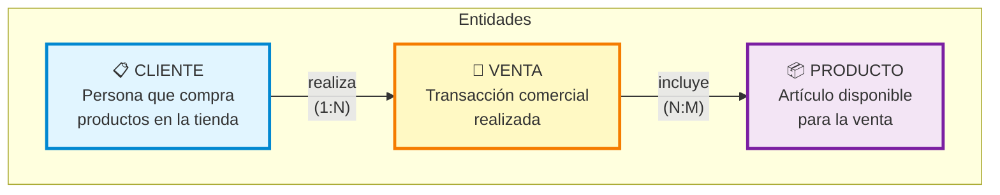
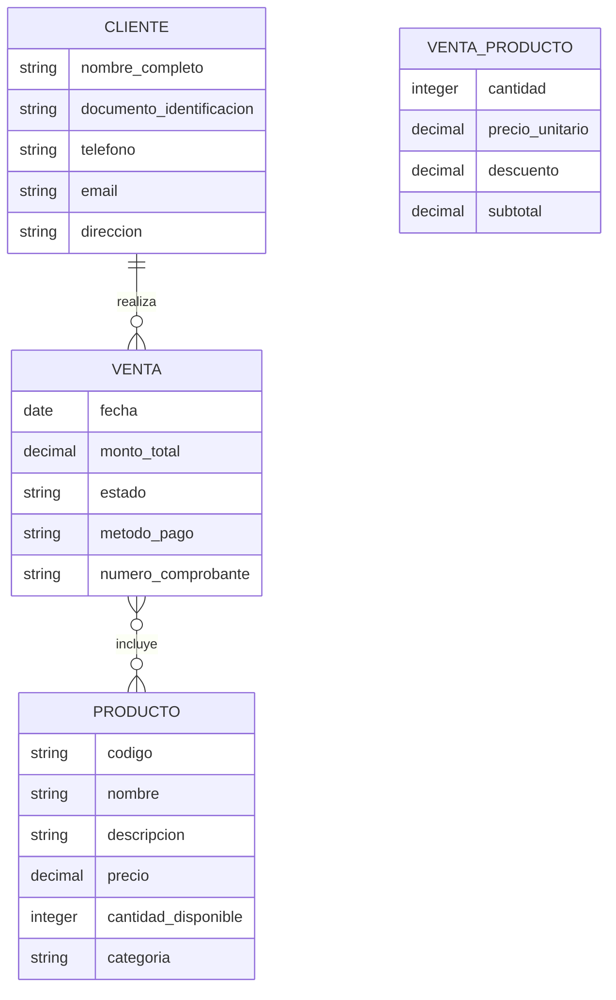
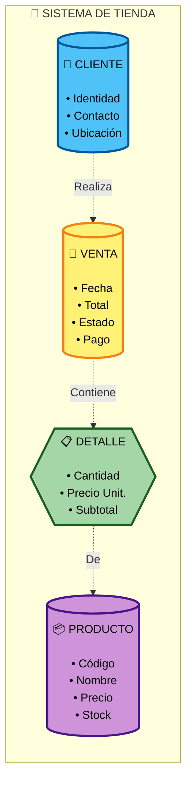

# 🏪 Modelo Conceptual de Base de Datos - Sistema de Tienda

> **Fecha de creación:** 22 de noviembre de 2025  
> **Descripción:** Modelo conceptual para gestión de ventas en una tienda  
> **Nivel:** Conceptual (alto nivel, independiente de implementación)

---

## 📊 Diagrama Conceptual Entidad-Relación

---

## 🎯 Entidades del Sistema

### 👤 **CLIENTE**
**Descripción:** Persona natural o jurídica que realiza compras en la tienda.

**Atributos:**
- Nombre completo
- Documento de identificación
- Información de contacto (teléfono, email)
- Dirección física
- Fecha de registro

---

### 🛒 **VENTA**
**Descripción:** Operación comercial mediante la cual un cliente adquiere uno o más productos.

**Atributos:**
- Fecha y hora de la transacción
- Monto total
- Estado de la venta
- Método de pago utilizado
- Número de comprobante

---

### 📦 **PRODUCTO**
**Descripción:** Artículo o mercancía disponible para ser vendida en la tienda.

**Atributos:**
- Código identificador
- Nombre del producto
- Descripción
- Precio de venta
- Cantidad en inventario
- Categoría
- Unidad de medida

---

## 🔗 Relaciones entre Entidades

### 1️⃣ **CLIENTE realiza VENTA**
- **Cardinalidad:** 1:N (uno a muchos)
- **Descripción:** Un cliente puede realizar muchas ventas a lo largo del tiempo, pero cada venta es realizada por un único cliente.
- **Regla de negocio:** Toda venta debe estar asociada a un cliente registrado.

---

### 2️⃣ **VENTA incluye PRODUCTO**
- **Cardinalidad:** N:M (muchos a muchos)
- **Descripción:** Una venta puede incluir múltiples productos, y un producto puede estar en múltiples ventas.
- **Atributos de la relación:**
  - Cantidad vendida
  - Precio unitario al momento de la venta
  - Descuento aplicado (si existe)
  - Subtotal de la línea
- **Regla de negocio:** Una venta debe tener al menos un producto.

---

## 📐 Diagrama Conceptual Detallado

**Nota:** La relación N:M entre VENTA y PRODUCTO se representa mediante la entidad asociativa `VENTA_PRODUCTO` (también conocida como DETALLE_VENTA).

---

## 📚 Restricciones y Reglas de Negocio

### Restricciones de Integridad:
1. **Cliente obligatorio:** Toda venta debe estar asociada a un cliente
2. **Producto obligatorio:** Una venta debe incluir al menos un producto
3. **Cantidades positivas:** Las cantidades vendidas deben ser mayores a cero
4. **Disponibilidad:** No se puede vender más productos de los disponibles en inventario

### Reglas de Negocio:
1. El precio de venta se registra al momento de la transacción (puede diferir del precio actual del producto)
2. El monto total de la venta es la suma de todos los subtotales de los productos
3. Un cliente puede tener múltiples ventas en diferentes fechas
4. Un mismo producto puede aparecer en múltiples ventas
5. El stock del producto se reduce cuando se confirma una venta

---

## 🎨 Modelo Conceptual Visual Alternativo

---

## � Descripción del Proceso de Negocio

### Flujo Principal:
1. Un **CLIENTE** llega a la tienda con la intención de comprar
2. Selecciona uno o varios **PRODUCTOS** del catálogo disponible
3. Se genera una **VENTA** que registra:
   - Quién compra (cliente)
   - Qué compra (productos)
   - Cuánto paga (total)
   - Cómo paga (método de pago)
4. La relación entre la VENTA y los PRODUCTOS se detalla en el **DETALLE DE VENTA** donde se especifica:
   - Cantidad de cada producto
   - Precio al que se vendió
   - Subtotal y descuentos

---

## 🔍 Características del Modelo Conceptual

### ✅ Ventajas:
- **Simplicidad:** Fácil de entender para usuarios no técnicos
- **Independencia:** No depende de la tecnología de base de datos
- **Enfoque en el negocio:** Refleja las necesidades reales de la tienda
- **Comunicación:** Facilita el diálogo entre analistas y stakeholders

### 🎯 Propósito:
Este modelo conceptual sirve como base para:
- Comunicar la estructura del sistema a los interesados
- Documentar los requisitos del negocio
- Servir como punto de partida para el diseño lógico y físico
- Validar que se capturen todos los datos necesarios

---

## � Glosario de Términos

| Término | Definición |
|---------|-----------|
| **Entidad** | Objeto o concepto del mundo real que tiene existencia independiente |
| **Atributo** | Característica o propiedad que describe una entidad |
| **Relación** | Asociación entre dos o más entidades |
| **Cardinalidad** | Número de instancias de una entidad que pueden asociarse con otra |
| **1:N** | Uno a muchos (un cliente puede tener muchas ventas) |
| **N:M** | Muchos a muchos (una venta puede tener muchos productos, y un producto puede estar en muchas ventas) |

---

¡Modelo conceptual completado! 🎉

**Nota:** Este es el modelo de **alto nivel** (conceptual). Para la implementación en base de datos se requiere transformar este modelo a:
- **Modelo Lógico:** Define estructuras de datos, claves primarias/foráneas, tipos de datos
- **Modelo Físico:** Especifica detalles de implementación, índices, particiones, etc.
