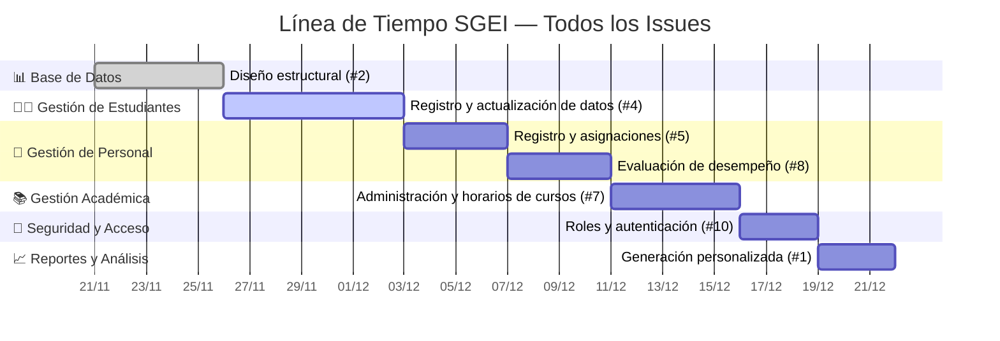
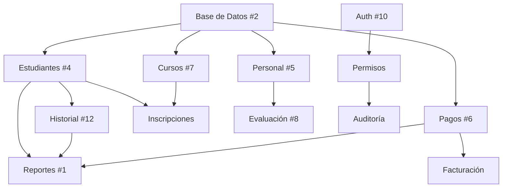

# 🗓️ Línea de Tiempo — Timeline de Todos los Issues SGEI

> **Última actualización:** 21 de noviembre de 2025  
> **Proyecto:** Sistema de Gestión Educativa Integral (SGEI)  
> **Duración Total Estimada:** 31 días (aprox. 6.2 semanas)

---

## 📋 Tabla Resumen de Issues en Timeline

| #   | Issue                              | Módulo                        | Inicio      | Duración | Estado      | Prioridad | URL                                                    |
|-----|-----------------------------------|-------------------------------|-------------|----------|-------------|-----------|--------------------------------------------------------|
| 2   | Diseño estructural DB             | Base de Datos                 | 2025-11-21  | 5 días   | ✅ Completo | Alta      | [Ver](https://github.com/CEPE1724/my-app/issues/2)    |
| -   | Optimización DB                   | Base de Datos                 | 2025-11-26  | 2 días   | 🔄 Progreso | Media     | -                                                      |
| 4   | Registro estudiantes              | Gestión Estudiantes           | 2025-11-28  | 7 días   | 🔄 Activo   | Alta      | [Ver](https://github.com/CEPE1724/my-app/issues/4)    |
| -   | Asistencia y calificaciones       | Gestión Estudiantes           | 2025-12-05  | 5 días   | ⏳ Pendiente| Alta      | -                                                      |
| 12  | Historial académico               | Gestión Estudiantes           | 2025-12-10  | 3 días   | ⏳ Pendiente| Media     | [Ver](https://github.com/CEPE1724/my-app/issues/12)   |
| 5   | Registro personal                 | Gestión Personal              | 2025-12-05  | 4 días   | ⏳ Pendiente| Alta      | [Ver](https://github.com/CEPE1724/my-app/issues/5)    |
| 8   | Evaluación desempeño              | Gestión Personal              | 2025-12-09  | 4 días   | ⏳ Pendiente| Media     | [Ver](https://github.com/CEPE1724/my-app/issues/8)    |
| -   | Control horarios personal         | Gestión Personal              | 2025-12-13  | 3 días   | ⏳ Pendiente| Media     | -                                                      |
| 7   | Administrar horarios/cursos       | Gestión Académica             | 2025-12-13  | 5 días   | ⏳ Pendiente| Alta      | [Ver](https://github.com/CEPE1724/my-app/issues/7)    |
| -   | Gestión materias                  | Gestión Académica             | 2025-12-18  | 4 días   | ⏳ Pendiente| Alta      | -                                                      |
| -   | Inscripciones                     | Gestión Académica             | 2025-12-22  | 3 días   | ⏳ Pendiente| Alta      | -                                                      |
| 10  | Roles y autenticación             | Seguridad                     | 2025-12-18  | 3 días   | ⏳ Pendiente| Crítica   | [Ver](https://github.com/CEPE1724/my-app/issues/10)   |
| -   | Permisos granulares               | Seguridad                     | 2025-12-21  | 2 días   | ⏳ Pendiente| Alta      | -                                                      |
| -   | Auditoría y logs                  | Seguridad                     | 2025-12-23  | 2 días   | ⏳ Pendiente| Media     | -                                                      |
| 1   | Reportes personalizados           | Reportes                      | 2025-12-21  | 3 días   | ⏳ Pendiente| Media     | [Ver](https://github.com/CEPE1724/my-app/issues/1)    |
| -   | Dashboards                        | Reportes                      | 2025-12-24  | 4 días   | ⏳ Pendiente| Media     | -                                                      |
| -   | Exportación datos                 | Reportes                      | 2025-12-28  | 2 días   | ⏳ Pendiente| Baja      | -                                                      |
| 6   | Control pagos y pensiones         | Gestión Financiera            | 2025-12-05  | 5 días   | ⏳ Pendiente| Alta      | [Ver](https://github.com/CEPE1724/my-app/issues/6)    |
| -   | Facturación electrónica           | Gestión Financiera            | 2025-12-10  | 4 días   | ⏳ Pendiente| Alta      | -                                                      |
| -   | Reportes financieros              | Gestión Financiera            | 2025-12-14  | 3 días   | ⏳ Pendiente| Media     | -                                                      |
| 9   | Sistema notificaciones            | Comunicación                  | 2025-12-21  | 3 días   | ⏳ Pendiente| Media     | [Ver](https://github.com/CEPE1724/my-app/issues/9)    |
| -   | Mensajería interna                | Comunicación                  | 2025-12-24  | 3 días   | ⏳ Pendiente| Baja      | -                                                      |
| -   | Portal padres                     | Comunicación                  | 2025-12-27  | 4 días   | ⏳ Pendiente| Media     | -                                                      |
| -   | Testing                           | QA                            | 2025-12-30  | 5 días   | ⏳ Pendiente| Crítica   | -                                                      |
| -   | UAT                               | QA                            | 2026-01-04  | 4 días   | ⏳ Pendiente| Crítica   | -                                                      |
| -   | Deploy producción                 | Deployment                    | 2026-01-08  | 2 días   | ⏳ Pendiente| Crítica   | -                                                      |
| -   | Capacitación usuarios             | Deployment                    | 2026-01-10  | 3 días   | ⏳ Pendiente| Alta      | -                                                      |

---

## 📊 Estadísticas del Proyecto

- **Total de tareas:** 28
- **Issues principales:** 9 (con issues de GitHub)
- **Tareas adicionales:** 19
- **Duración estimada:** ~85 días (17 semanas)
- **Fecha inicio:** 21 de noviembre de 2025
- **Fecha estimada de finalización:** 13 de enero de 2026

### Estado Actual
- ✅ **Completo:** 1 tarea (3.6%)
- 🔄 **En progreso:** 2 tareas (7.1%)
- ⏳ **Pendiente:** 25 tareas (89.3%)

---

## 🎯 Hitos Principales (Milestones)

| Hito                          | Fecha Estimada | Tareas Incluidas                              |
|-------------------------------|----------------|-----------------------------------------------|
| 🏗️ Infraestructura Base      | 28 Nov 2025    | DB, Optimización                              |
| 👥 Módulo de Personas         | 16 Dic 2025    | Estudiantes, Personal                         |
| 📚 Módulo Académico           | 25 Dic 2025    | Cursos, Materias, Inscripciones               |
| 🔐 Seguridad Completa         | 25 Dic 2025    | Auth, Roles, Permisos, Auditoría              |
| 💰 Módulo Financiero          | 17 Dic 2025    | Pagos, Facturación, Reportes                  |
| 📊 Reportes y Analytics       | 30 Dic 2025    | Reportes, Dashboards, Exportación             |
| 📱 Comunicación               | 31 Dic 2025    | Notificaciones, Mensajería, Portal Padres     |
| ✅ Calidad y Testing          | 08 Ene 2026    | Testing, UAT                                  |
| 🚀 Go Live                    | 13 Ene 2026    | Deploy, Capacitación                          |

---

## 📌 Dependencias Críticas

---

## 💡 Notas Importantes

1. **Paralelización:** Los módulos de Gestión Financiera (#6) y Gestión de Estudiantes (#4) pueden desarrollarse en paralelo después de completar la Base de Datos.

2. **Prioridades:** 
   - Críticas: Seguridad (#10), Testing, Deployment
   - Altas: DB (#2), Estudiantes (#4), Personal (#5), Cursos (#7), Financiero (#6)
   - Medias: Evaluación (#8), Reportes (#1), Comunicación (#9)

3. **Riesgos:**
   - La autenticación (#10) es bloqueante para producción
   - El testing debe incluir todos los módulos previos
   - La capacitación debe planificarse con anticipación

---

