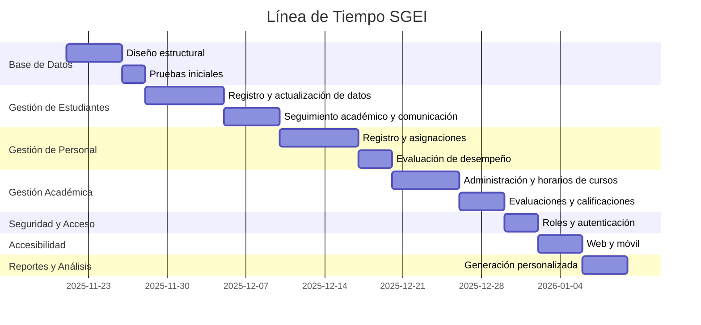

# 🗓️ Línea de Tiempo del Proyecto SGEI

Simulación Estado Board (Kanban):

| Estado      | Tareas                                                           |
|-------------|------------------------------------------------------------------|
| To Do       | Diseño estructural, Seguimiento académico y comunicación, Registro y asignaciones, Administración y horarios de cursos, Web y móvil, Generación personalizada de reportes |
| In Progress | Registro y actualización de datos, Pruebas iniciales, Evaluación de desempeño, Evaluaciones y calificaciones |
| Done        | Roles y autenticación                                            |
