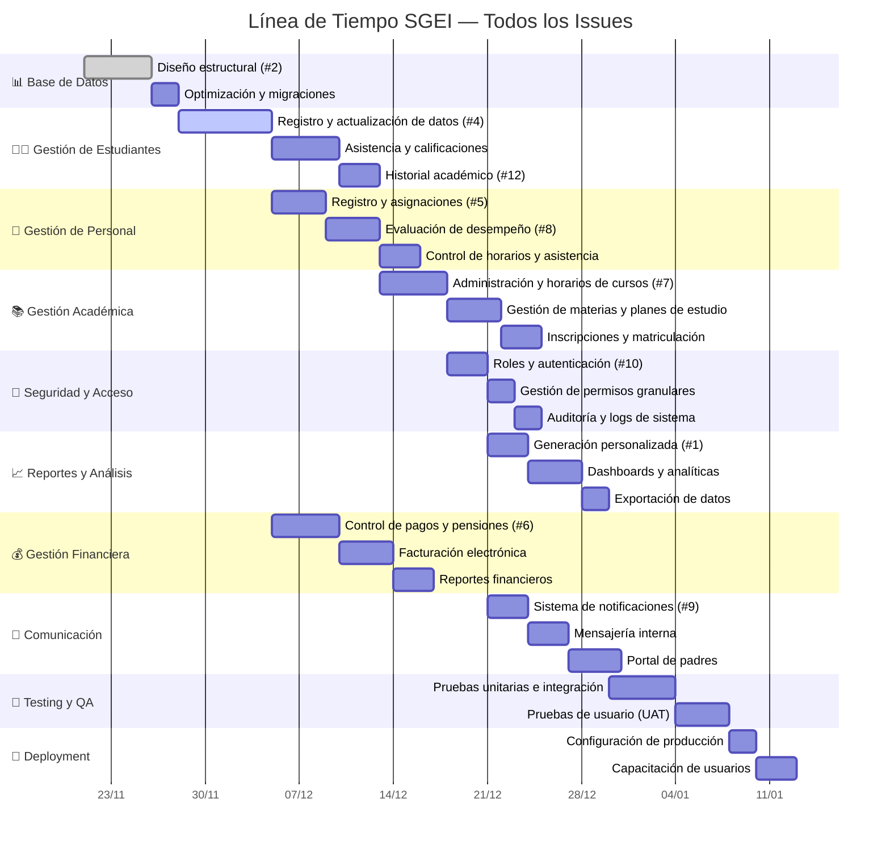

# 🗓️ Línea de Tiempo — Timeline de Todos los Issues SGEI

> **Última actualización:** 21 de noviembre de 2025  
> **Proyecto:** Sistema de Gestión Educativa Integral (SGEI)  
> **Duración Total Estimada:** 31 días (aprox. 6.2 semanas)

---

## Tabla resumen de issues en timeline

| Issue   | Módulo                        | Inicio      | Duración | URL                                                               |
|---------|-------------------------------|-------------|----------|-------------------------------------------------------------------|
| #2      | Base de Datos                 | 2025-11-21  | 5 días   | [Ver issue](https://github.com/CEPE1724/my-app/issues/2)          |
| #4      | Gestión Estudiantes           | 2025-11-26  | 7 días   | [Ver issue](https://github.com/CEPE1724/my-app/issues/4)          |
| #5      | Gestión Personal (registro)   | 2025-12-03  | 4 días   | [Ver issue](https://github.com/CEPE1724/my-app/issues/5)          |
| #8      | Evaluación desempeño personal | 2025-12-07  | 4 días   | [Ver issue](https://github.com/CEPE1724/my-app/issues/8)          |
| #7      | Administrar horarios/cursos   | 2025-12-11  | 5 días   | [Ver issue](https://github.com/CEPE1724/my-app/issues/7)          |
| #10     | Roles y autenticación         | 2025-12-16  | 3 días   | [Ver issue](https://github.com/CEPE1724/my-app/issues/10)         |
| #1      | Reportes personalizados       | 2025-12-19  | 3 días   | [Ver issue](https://github.com/CEPE1724/my-app/issues/1)          |

---

